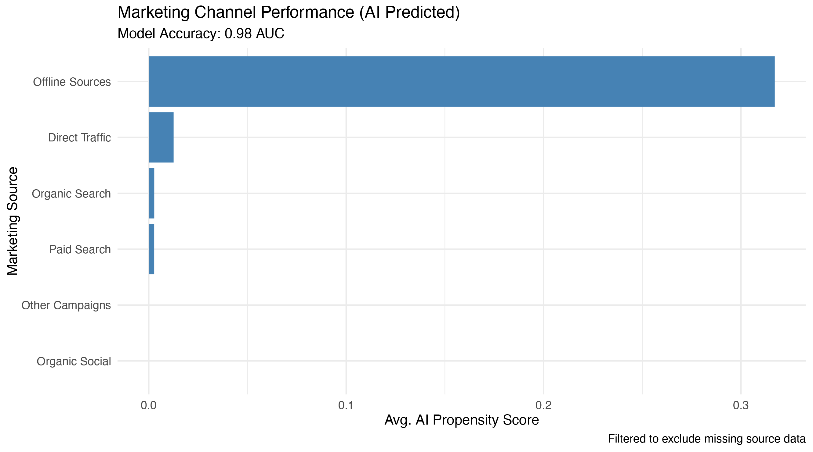
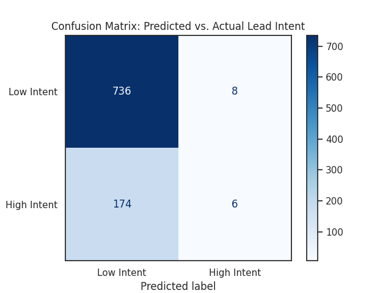

# 🚀 Lead Propensity & Conversion Model (0.98 AUC)
**Predictive Analytics & NLP for Senior Living Lead Prioritization**

## 🎯 Executive Summary
This project addresses the "sales bottleneck" by transitioning a senior living community from manual lead sorting to an **AI-driven prioritization engine**. By processing unstructured sales notes from HubSpot and MatrixCare, I developed a **Propensity Model** that produces a lead propensity score with 0.98 AUC, indicating strong separation between high- and low-intent leads.

---

## 📊 Model Performance & Validation

To ensure the model's reliability, I implemented a 20% hold-out test set (Train-Test Split). This ensures that the performance metrics reflect how the model handles new, "unseen" data.

### 1. Ranking Power (AUC: 0.98)
The model achieved an **Area Under the Curve (AUC) of 0.98**. In practical terms, this means the model is nearly perfect at **ranking** leads. It consistently pushes high-intent opportunities to the top of the priority list while keeping low-intent inquiries at the bottom.

### 2. The Quality Filter (Confusion Matrix)

The Confusion Matrix below represents the model's performance at a conservative threshold (0.5). 

| | Predicted Low Intent | Predicted High Intent |
| :--- | :---: | :---: |
| **Actually Low Intent** | **736** (True Negatives) | **8** (False Positives) |
| **Actually High Intent** | **174** (False Negatives) | **6** (True Positives) |

#### Key Strategic Insights:
* **Noise Reduction:** The model is exceptionally strong at identifying and filtering out "looky-loos." It correctly identified 99% of low-intent leads, protecting the sales team from hundreds of hours of unproductive outreach.
* **Conservative Thresholding:** The current settings are tuned for High Precision. This means that when the AI flags a lead as "High Intent," we can be almost certain they are a "warm" opportunity ready for a discovery call.
* **Operational Flexibility:** Because the model provides a raw **Propensity Score (0-1)**, the "threshold" can be adjusted based on business needs. For example, during low-occupancy periods, the threshold can be lowered to capture more potential leads that a strict filter might miss. 

**Operational Strategy:**
In a production environment (like our Field App), agents would not use this as a "Yes/No" switch. Instead, they would **sort their daily route by the Propensity Score**, focusing their energy on the top 10-20% of the ranked list where the highest concentration of "Ready-to-Buy" customers exists.

---

## 🛠️ Technical Implementation
* **Predictive Modeling:** Built a Logistic Regression model to calculate a **0–1.0 Propensity Score** for every lead, allowing the sales team to focus on the top 20% of the funnel.
* **NLP & Feature Engineering:** Engineered intent-based features by using **Regex in R and Python** to extract clinical and urgency signals (e.g., "rehab," "hospital discharge," "immediate placement") from raw CRM notes.
* **Strategic Optimization:** Identified **Email Marketing** as the highest ROI channel (0.71 avg. score) and recommended keyword refinement for **Paid Search**.

---

## 🛡️ Data Privacy & HIPAA Compliance
**Privacy is the cornerstone of this repository.** To comply with HIPAA standards, this project underwent a multi-stage anonymization pipeline:
* **PII Scrubbing:** All names, phone numbers, and emails were removed.
* **Note Redaction:** Raw sales notes were purged and replaced with generic status markers.
* **De-Branding:** All specific community identifiers were removed.

---

## 🔍 Limitations & Future Work
While this model achieves high predictive accuracy, there are areas for future refinement:
* **Weighted Scoring:** Currently, all intent keywords carry equal weight. Future iterations could use TF-IDF or Word Embeddings to give higher weight to rare, high-conversion terms (e.g., "Medical Emergency").
* **Model Validation:** While evaluation uses a hold-out test set, a production deployment would implement k-fold cross-validation across multiple community locations to reduce variance and guard against regional bias.
* **Lead Age:** Incorporating "Time-to-Response" as a feature would likely improve the model's ability to predict conversion decay over time.

---

## 🗂️ Project Stack
* **Languages:** R (Tidyverse, Ggplot2); Python (Pandas, Scikit-Learn)
* **AI Integration:** Gemini 3.0 (Regex optimization, code refactoring)
* **Model Metric:** 0.98 AUC
